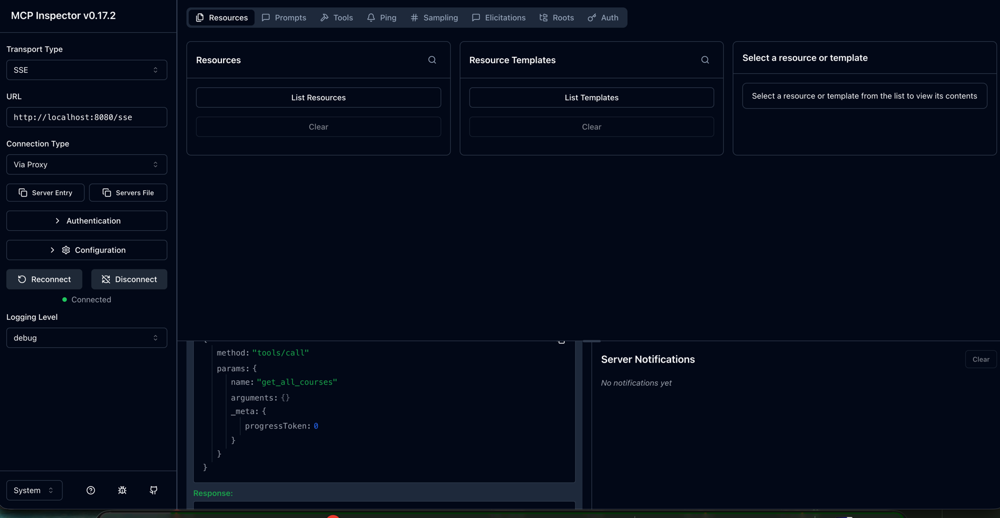

# MCP Server WebMVC

## Request Examples

The tool `npx @modelcontextprotocol/inspector` can be used to debug. See this [doc](https://developers.cloudflare.com/agents/guides/test-remote-mcp-server/).



### Initialize SSE

A first call is performed on `GET http://localhost:8080/sse?transportType=sse` that returns a session id (in our example `fd4f549a-3fdb-4211-b801-3a1b8393af67`). This session id will be used in the following requests.


### Initialize

Initialize the connexion state: `POST http://localhost:8080/mcp/message?sessionId=fd4f549a-3fdb-4211-b801-3a1b8393af67`.

Request:
````
{
  "jsonrpc": "2.0",
  "id": 1,
  "method": "initialize",
  "params": {
    "protocolVersion": "2025-03-26",
    "capabilities": {
      "tools": {},
      "resources": {},
      "prompts": {}
    },
    "clientInfo": {
      "name": "test-client",
      "version": "1.0.0"
    }
  }
}
````

Response:
````json
{"jsonrpc":"2.0","id":1,"result":{"protocolVersion":"2024-11-05","capabilities":{"completions":{},"logging":{},"prompts":{"listChanged":true},"resources":{"subscribe":false,"listChanged":true},"tools":{"listChanged":true}},"serverInfo":{"name":"sgerard-hands-on-webmvc","version":"1.0.0"}}}
````


### tools/call

Request:
````
{
  "method": "tools/call",
  "params": {
    "name": "get_all_courses",
    "arguments": {},
    "_meta": {
      "progressToken": 0
    }
  }
}
````

Response:
````
{
  "content": [
    {
      "type": "text",
      "text": "[\"MCP Hands-On\"]"
    }
  ],
  "isError": false
}
````


### tools/list

Request:
````
{
  "method": "tools/list",
  "params": {}
}
````

Response:
````
{
  "tools": [
    {
      "name": "get_course_by_title",
      "description": "Get a course by its title.",
      "inputSchema": {
        "type": "object",
        "properties": {
          "title": {
            "type": "string"
          }
        },
        "required": [
          "title"
        ],
        "additionalProperties": false
      }
    },
    {
      "name": "update_course_description",
      "description": "Update course description.",
      "inputSchema": {
        "type": "object",
        "properties": {
          "title": {
            "type": "string"
          },
          "description": {
            "type": "string"
          }
        },
        "required": [
          "title",
          "description"
        ],
        "additionalProperties": false
      }
    },
    {
      "name": "delete_course_by_title",
      "description": "Delete course by its title.",
      "inputSchema": {
        "type": "object",
        "properties": {
          "title": {
            "type": "string"
          }
        },
        "required": [
          "title"
        ],
        "additionalProperties": false
      }
    },
    {
      "name": "create_course",
      "description": "Create a new course.",
      "inputSchema": {
        "type": "object",
        "properties": {
          "course": {
            "type": "object",
            "properties": {
              "description": {
                "type": "string"
              },
              "title": {
                "type": "string"
              }
            },
            "required": [
              "description",
              "title"
            ]
          }
        },
        "required": [
          "course"
        ],
        "additionalProperties": false
      }
    },
    {
      "name": "get_all_courses",
      "description": "Get all courses.",
      "inputSchema": {
        "type": "object",
        "properties": {},
        "required": [],
        "additionalProperties": false
      }
    }
  ]
}
````